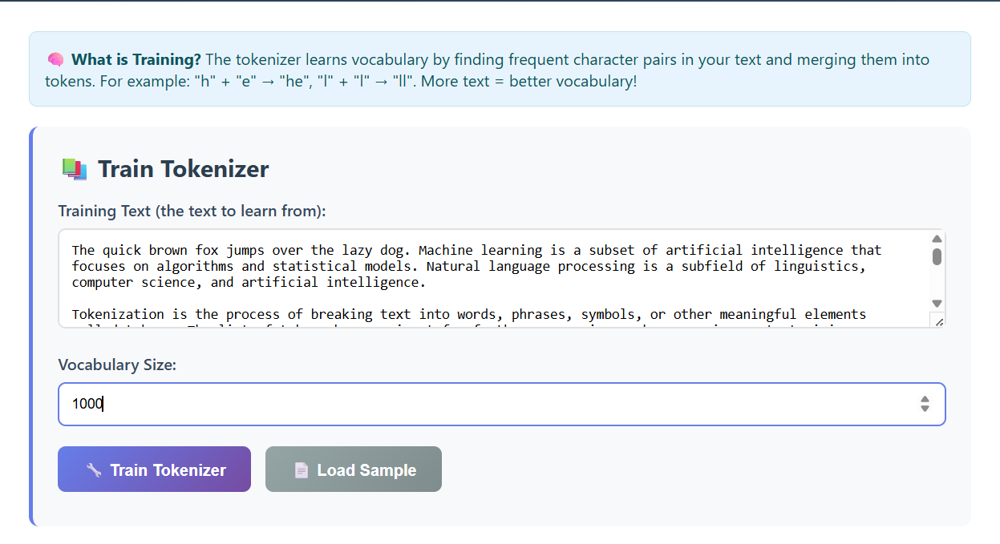
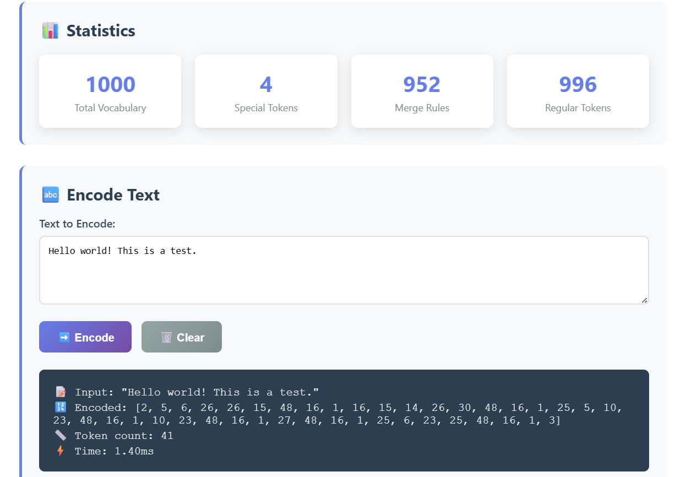
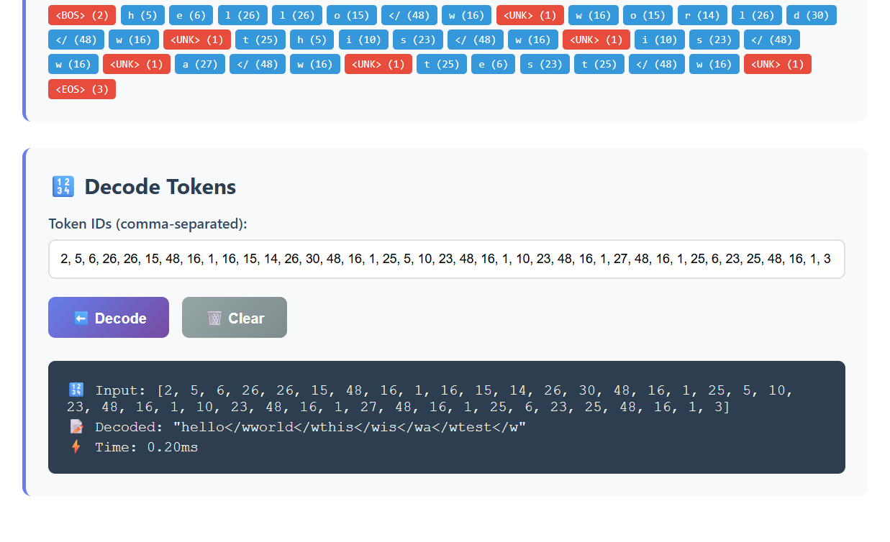

# BPE (Byte Pair Encoding) Tokenizer

Byte Pair Encoding (BPE) tokenizer with a beautiful web interface that teaches users exactly how tokenizer training works.

## 🧠 What is a Tokenizer?

A **tokenizer** is a crucial component in AI and Natural Language Processing that converts text into numbers that computers can understand. Think of it as teaching a computer to read by breaking words into manageable pieces.

### Why Tokenizers are Essential

- **AI Models Need Numbers**: Neural networks work with numbers, not text
- **Handle Unknown Words**: Break unseen words into known pieces
- **Efficiency**: Fewer tokens = faster processing
- **Universal**: Can handle any language or domain

## 🎯 What is Training?

**Training** means teaching the tokenizer to learn vocabulary from text by finding and merging frequent character pairs.

### The Process Step-by-Step:

1. **Start with Characters**: `h`, `e`, `l`, `l`, `o`, `w`, `o`, `r`, `l`, `d`
2. **Find Frequent Pairs**: `l`+`l` appears often in "hello"
3. **Merge Them**: Create new token `ll`
4. **Repeat**: Continue finding and merging until vocabulary is complete
5. **Result**: Efficient tokens that can encode any text

## 🖼️ Screenshots

Below are screenshots of the web interface in action:





### Real Example:

```
Input: "hello hello world world"
Step 1: ['h','e','l','l','o'] ['h','e','l','l','o'] ['w','o','r','l','d'] ['w','o','r','l','d']
Step 2: Find 'l'+'l' appears most frequently (4 times)
Step 3: Merge: ['h','e','ll','o'] ['h','e','ll','o'] ['w','o','r','l','d'] ['w','o','r','l','d']
Step 4: Find 'h'+'e' appears frequently (2 times)
Step 5: Merge: ['he','ll','o'] ['he','ll','o'] ['w','o','r','l','d'] ['w','o','r','l','d']
Result: Efficient vocabulary with tokens like 'he', 'll', 'o', 'w', 'r', 'd'
```

## � Why BPE (Byte Pair Encoding)?

### Advantages:

- **Subword Tokenization**: Balances between character and word level
- **Handles Unknown Words**: Never fails on new text
- **Efficient**: Optimal vocabulary size vs. representation quality
- **Modern Standard**: Used in GPT, BERT, and other state-of-the-art models

### How BPE Works:

1. **Initialize**: Start with character-level vocabulary
2. **Count Pairs**: Find most frequent adjacent character/token pairs
3. **Merge**: Replace most frequent pair with new token
4. **Iterate**: Repeat until desired vocabulary size
5. **Apply**: Use learned merge rules to encode new text

## 🏗️ Project Structure

```
bpe-tokenizer/
├── tokenizer.js         # Universal BPE implementation (works everywhere)
├── index.html          # Interactive web interface
├── package.json        # Project configuration
├── README.md          # This comprehensive guide
└── sample-data/       # Example training texts
    └── shakespeare.txt
```

## 🛠️ Setup & Installation

### Prerequisites

- **Web Browser**: Any modern browser (Chrome, Firefox, Safari, Edge)
- **Web Server**: Node.js or Python

### No Dependencies Required

This is a **pure JavaScript** implementation with no external libraries or build process needed!

### Installation Steps

1. **Download/Clone** the project
2. **Navigate** to the project directory
3. **Start web server** (see options below)
4. **Open browser** and start learning!

## 🌐 How to Run

### Option 1: Node.js Web Server

```bash
# Start server with Node.js
npm run start:node
# or manually
npx http-server -p 8000 -c-1

# Open browser
http://localhost:8000
```

### Option 2: Python Web Server

```bash
# Start server
npm run start:python
# or manually
python -m http.server 8000

# Open browser
http://localhost:8000
```

### Option 3: Alternative Ports

If port 8000 is busy:

```bash
# Use different port
python -m http.server 8001
# or
npx http-server -p 8001 -c-1
```

## 📖 How to Use the Interface

### 1. 🔧 Train the Tokenizer

- **Load Sample**: Click "Load Sample" to get example text
- **Enter Text**: Or paste your own text to learn from
- **Set Vocabulary Size**: Choose 50-2000 tokens (200-500 recommended)
- **Click Train**: Watch the learning process in real-time!

### 2. 📊 Monitor Statistics

- **Total Vocabulary**: See how many tokens were learned
- **Special Tokens**: Built-in tokens for padding, unknown words, etc.
- **Merge Rules**: Number of character pair merges learned
- **Regular Tokens**: Vocabulary learned from your text

### 3. 🔤 Encode Text

- **Enter Text**: Type any text to convert to tokens
- **See Results**: View token IDs and visual breakdown
- **Performance**: Check encoding speed
- **Visual Tokens**: Color-coded display of each token

### 4. 🔢 Decode Tokens

- **Token IDs**: Enter comma-separated numbers
- **Auto-Fill**: Automatically filled from encoding results
- **Verify**: Check that decoding matches original text
- **Round-Trip**: Test encoding → decoding accuracy

## ⚡ Technical Details

### Technical Implementation

- **Algorithm**: Pure BPE implementation from scratch
- **Data Structures**: Efficient Map-based vocabulary storage
- **Memory**: Optimized for browser environments
- **Compatibility**: Works in all modern browsers

### Special Tokens

- **`<PAD>` (ID: 0)**: Padding for batch processing
- **`<UNK>` (ID: 1)**: Unknown/out-of-vocabulary words
- **`<BOS>` (ID: 2)**: Beginning of sequence marker
- **`<EOS>` (ID: 3)**: End of sequence marker

## 🔧 Configuration Options

### Package.json Scripts

```json
{
  "scripts": {
    "start:python": "python -m http.server 8000",
    "start:node": "npx http-server -p 8000 -c-1"
  }
}
```

### Vocabulary Size Guidelines

- **Small (50-100)**: Fast training, basic vocabulary
- **Medium (200-500)**: Balanced performance and coverage
- **Large (1000-2000)**: Comprehensive vocabulary, slower training

### Training Text Recommendations

- **Minimum**: 100+ characters for meaningful results
- **Optimal**: 1000+ characters for good vocabulary
- **Maximum**: No limit, but larger texts take longer to train

## 🚀 Quick Start Guide

### 5-Minute Demo:

1. **Start Server**: `npm run start:node or npm run start:python`
2. **Open Browser**: `http://localhost:8000`
3. **Load Sample**: Click "Load Sample" button
4. **Train**: Click "Train Tokenizer" and watch the magic!
5. **Encode**: Try encoding "Hello world" in the encode section
6. **Decode**: See the token IDs convert back to text
7. **Experiment**: Try your own text and different vocabulary sizes
